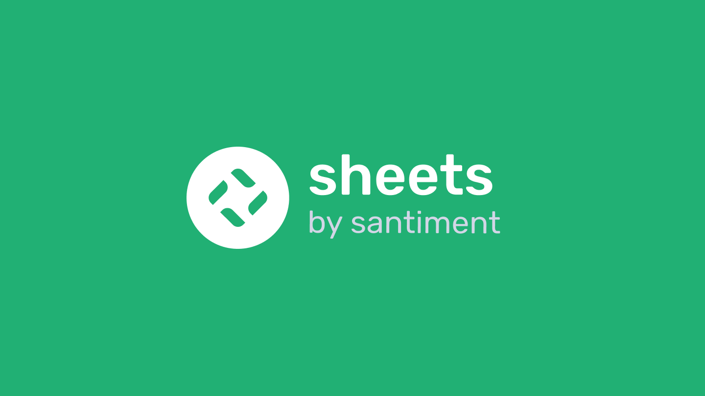

# Sheets landing page



This is the source for [`Sheets Landing Page`](https://santiment.net/sansheets/).

## Running locally

If you have yarn you can run the app simply:

```bash
yarn
yarn start
```

This is going to run the app on port 8000, so [`localhost:8000`](http://localhost:8000) should be accessible.
